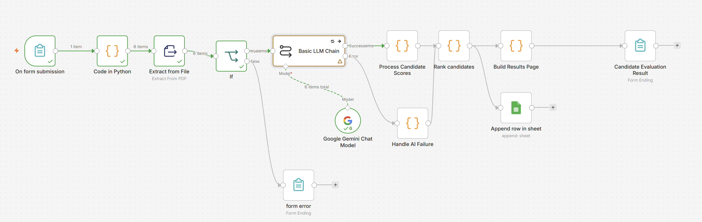

# AI Hiring Intelligence System

An AI-powered resume evaluation and candidate ranking system built with **n8n, Google Gemini, JavaScript, Python, and Google Sheets**.

The workflow accepts multiple PDF resumes and a job description, evaluates each candidate against the role, calculates structured scores, ranks candidates, and stores the results in Google Sheets.

> **Decision-support only:** AI-generated scores should not be the sole basis for hiring or rejection decisions.

## Workflow Overview



## Features

- Multi-resume PDF processing
- AI-powered resume vs. job description analysis
- Technical, project, education, and experience scoring
- Total vs. relevant professional experience
- Automatic candidate ranking
- Matched qualifications and skill-gap analysis
- Recruiter-friendly summaries
- Google Sheets integration
- AI failure and JSON parsing handling
- Prompt-injection and fairness instructions

## Workflow

```text
Resume Upload + Job Description
              ↓
       Split Resumes
              ↓
       Extract PDF Text
              ↓
       Validate Resume
              ↓
      Google Gemini AI
              ↓
    Process Candidate Scores
              ↓
       Rank Candidates
          ↙       ↘
 Results Page    Google Sheets
```

AI failures are routed to a separate manual-review path instead of being silently discarded.

## Scoring

| Category | Weight |
|---|---:|
| Technical Skills | 30% |
| Experience | 40% |
| Projects | 15% |
| Education | 15% |

```text
Overall Score =
Technical × 30%
+ Projects × 15%
+ Education × 15%
+ Experience × 40%
```

### Relevant Experience

The system distinguishes between:

- **Total Experience** — all professional work experience.
- **Relevant Experience** — professional experience that can be clearly established as relevant to the job description.

Academic projects, personal projects, certifications, transferable skills, and isolated related tasks do not automatically count as relevant professional experience years.

## Tech Stack

- **n8n** — workflow automation
- **Google Gemini** — resume analysis
- **JavaScript** — score processing and validation
- **Python** — file processing, ranking and result generation
- **Google Sheets** — result storage

## Setup

1. Import the workflow JSON into n8n.
2. Configure Google Gemini credentials.
3. Connect Google Sheets account.
4. Select/create a spreadsheet for results.
5. Test using sample PDF resumes and a job description.
6. Activate the workflow.

> Never commit API keys, OAuth credentials, real candidate resumes, or private candidate data to GitHub.

## Limitations

- LLM evaluations may vary slightly between runs.
- Scoring weights and thresholds are heuristic and have not been formally validated against real hiring outcomes.
- The strict relevant-experience rule may give lower scores to strong candidates moving from adjacent fields.
- Experience-based score caps may disadvantage candidates with transferable skills but no established relevant professional duration.
- Scanned/image-based or complex PDFs may not extract correctly; OCR is not currently implemented.
- Unreadable PDFs currently follow an error path instead of being retained as manual-review candidate records.
- Prompt-based fairness safeguards cannot guarantee bias-free evaluations.
- Resume data is processed through third-party services such as Google Gemini and Google Sheets, so production use requires appropriate privacy, consent, access-control, and retention policies.
- Processing time and API usage increase as more resumes are evaluated; the current version is not optimized for large-scale concurrent processing.
- Human review is required before making employment decisions.

## Future Improvements

- OCR support for scanned resumes
- Concurrent/batch resume processing
- Configurable scoring weights
- Better unreadable-file handling
- Automated consistency testing
- Duplicate candidate detection
- Recruiter dashboard
- Fairness and bias testing

## Disclaimer

This project was developed for **educational and portfolio purposes**.

AI-generated rankings can be inaccurate, inconsistent, or biased. The system is intended to assist human reviewers and should not autonomously make hiring or rejection decisions.
